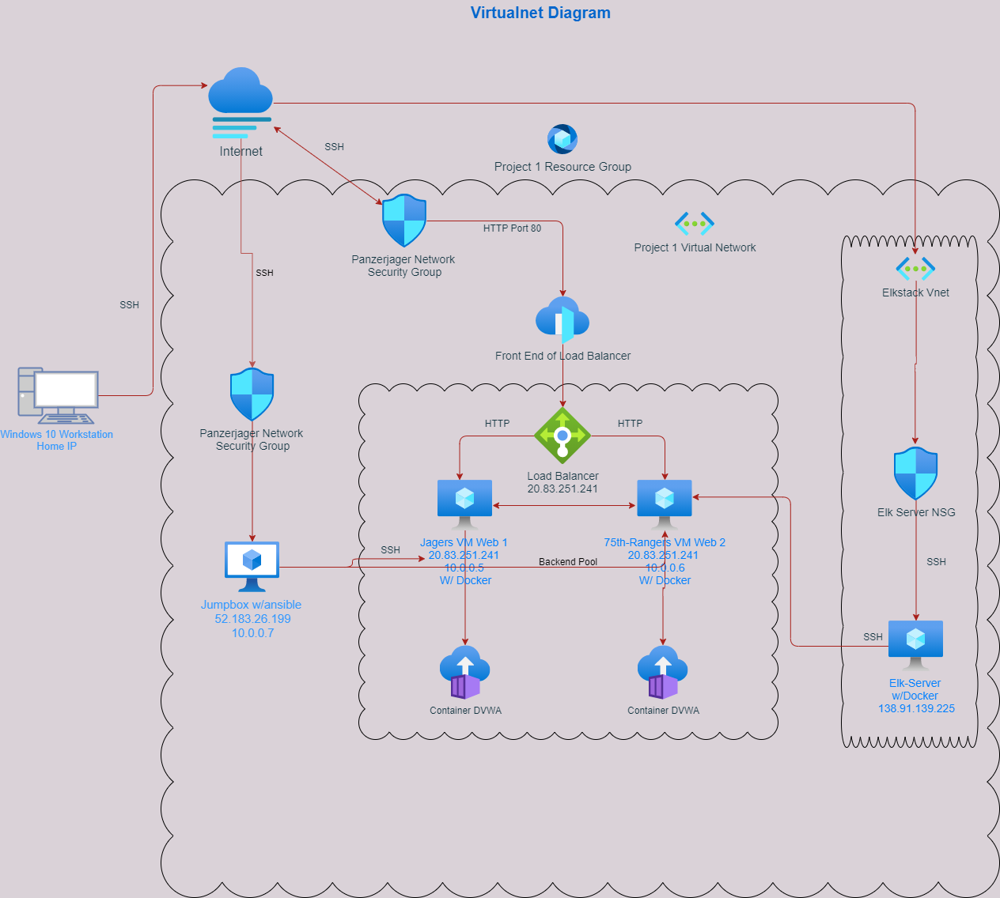

# Project-1 
## Automated ELK Stack Deployment

The files in this repository were used to configure the network depicted below.

 

These files have been tested and used to generate a live ELK deployment on Azure. They can be used to either recreate the entire deployment pictured above. Alternatively, select portions of the YAML file may be used to install only certain pieces of it, such as Filebeat.

  [Elk-playbook](Ansible/elkplaybook.yml)

This document contains the following details:
- Description of the Topology
- Access Policies
- ELK Configuration
  - Beats in Use
  - Machines Being Monitored
- How to Use the Ansible Build

### Description of the Topology

The main purpose of this network is to expose a load-balanced and monitored instance of DVWA, the D*mn Vulnerable Web Application.

Load balancing ensures that the application will be highly secure, in addition to restricting traffic to the network.
-  Load balancers are an important part of network security as they protect the incoming traffic to applications, and see all inbound requests. 
-  Jumpboxes are beneficial as they are hardened devices, which allow access to security zones into other devices. 
-  The jumpbox is singular point of access which can be monitored, and is accessed from a trusted network. 

Integrating an ELK server allows users to easily monitor the vulnerable VMs for changes to the logs and system services.
- Filebeat collects log data such as: log files, locations, log events and then forwards the information to elasticsearch.
- Metric beat looks out for metrics and statistics on the server with all running services.

The configuration details of each machine may be found below.

| Name     | Function | IP Address | Operating System |
|----------|----------|------------|------------------|
| Jump Box | Gateway  | 10.0.0.7   | Linux            |
| Jagers   |Web Server| 10.0.0.6   | Linux            |
| 75th Rang|Web Server| 10.0.0.6   | Linux            |
| Elk-Serve|Monitoring| 10.1.0.4   | Linux            |

### Access Policies

The machines on the internal network are not exposed to the public Internet. 

Only the jumpbox machine can accept connections from the Internet. Access to this machine is only allowed from the following IP addresses:
- xx.xxx.xxx.xx

Machines within the network can only be accessed by the jumpbox.
- The machine that can access the Elk VM is the Jumpbox with an IP of 10.0.0.7

A summary of the access policies in place can be found in the table below.

| Name     | Publicly Accessible | Allowed IP Addresses |
|----------|---------------------|----------------------|
| Jump Box | Yes                 | Personal Home IP     |
| Elk      | No                  | 10.0.0.1-254         |
| Jagers   | No                  | 10.0.0.1-254         |
| 75th Rang| No                  | 10.0.0.1-254         |

### Elk Configuration

Ansible was used to automate configuration of the ELK machine. No configuration was performed manually, which is advantageous because...
- The main advantage having Ansible configure the Elk machine automatically is that there won't be any hiccups and everything gets install in order.

The playbook implements the following tasks:
- _TODO: In 3-5 bullets, explain the steps of the ELK installation play. E.g., install Docker; download image; etc._
- Install docker.io 
- Install pip3 
- Install Docker python module 
- Increase virtual memory 
- download and launch a docker elk container

The following screenshot displays the result of running `docker ps` after successfully configuring the ELK instance.

[Docker-ps](Images/docker-ps.PNG)

### Target Machines & Beats
This ELK server is configured to monitor the following machines:
- 10.0.0.5 and 10.0.0.6

We have installed the following Beats on these machines:
- Filebeat 
- Metricbeat

These Beats allow us to collect the following information from each machine:
- Filebeat detects changes to the filesystem. Specifically, we use it to collect Apache logs.
- Metricbeat detects changes in system metrics, such as CPU usage. We use it to detect SSH login attempts, failed sudo escalations, and CPU/RAM statistics.

### Using the Playbook
In order to use the playbook, you will need to have an Ansible control node already configured. Assuming you have such a control node provisioned: 

SSH into the control node and follow the steps below:
- Copy the filebeat and metricbeat files to /etc/ansible.
- Update the configuration file to include the private IP addresses. 
- Run the playbook, and navigate to the Elk Server to check the webserver to make sure filebeat and metricbeat are there, ensuring that the installation worked as expected.

_TODO: Answer the following questions to fill in the blanks:_
- The YAML files are located in the pathway /etc/Ansible
- The hosts file needs to be changed for Ansible to run. To specifiy which machine installs ansible playbooks the [servername] needs to be set.
- To check if the Elk server is running open a web browser and type http://138.91.139.225/:5601/app/home 

Be familiar with ansible, mping, and the host playbook. 
